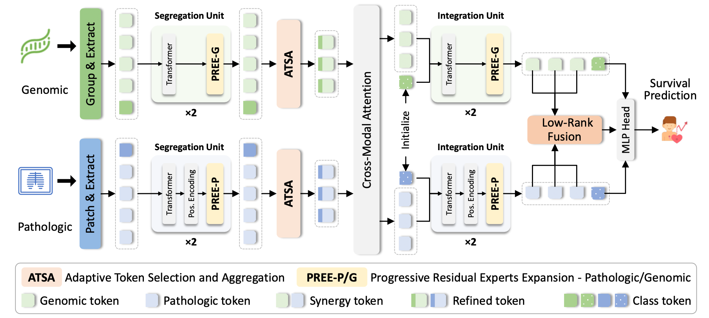

# AdaMHF
Adaptive Multi-modal Hierarchical Fusion for Survival Analysis



## Overview
AdaMHF (Adaptive Multimodal Hierarchical Fusion for Survival Prediction) is a deep learning framework designed for survival analysis using multi-modal data from whole slide images (WSIs) and genomic profiles. The framework adaptively fuses features from different modalities to improve survival prediction accuracy.

More model details, complete code, and process for preprocessing with CLAM are waiting to be added. Please stay tuned.


### Data Preparation
#### Whole Slide Images (WSIs)
1. Download WSIs from [TCGA](https://portal.gdc.cancer.gov/)
2. Extract features using the WSI processing pipeline from [CLAM](https://github.com/mahmoodlab/CLAM) ( We have chosen VIT-based CLAM for preprocessing. )
3. Save extracted features as .pt files for each WSI

Required data structure:
```bash
DATA_ROOT_DIR/
    └──pt_files/
        ├── slide1.pt
        ├── slide2.pt
        └── ...
```
Note: Specify DATA_ROOT_DIR using the --data_root_dir argument in run.sh

#### Genomic Data
To ensure proper formatting, download the gene data from [cBioPortal](https://www.cbioportal.org/). Store these profiles in the csv/ directory.

At the same time, please ensure that the gene and WSIs compatibility.

## Cross-Validation
The model employs 5-fold cross-validation. Prepare the splits in advance and store them in the `splits/5foldcv` directory.

## Training

Due to the temporary unavailability of the server, we are unable to provide the corresponding environment files. It is recommended that your environment be set to PyTorch version 2.4.0 or higher, and that you install compatible packages to avoid encountering strange errors such as “NoneType” or similar issues.


To train the model:
```bash
bash run.sh
```
Customize training parameters by modifying run.sh.

## Model Performance
[ To be added ]

## Citation
If you find this work useful, please cite our paper:
```
[Citation details to be added]
```

## Acknowledgements
We thank the authors of the following open-source projects:
- [CLAM](https://github.com/mahmoodlab/CLAM) - For WSI processing pipeline.
- [PIBD](https://github.com/zylbuaa/PIBD) - For genomic profile processing.
- [CMTA](https://github.com/FT-ZHOU-ZZZ/CMTA) - For multi-modal learning insights and code base.


## Contact
For questions and issues, please open an issue in this repository or report issues directly (for urgent blockers) to 2316072618@qq.com.

